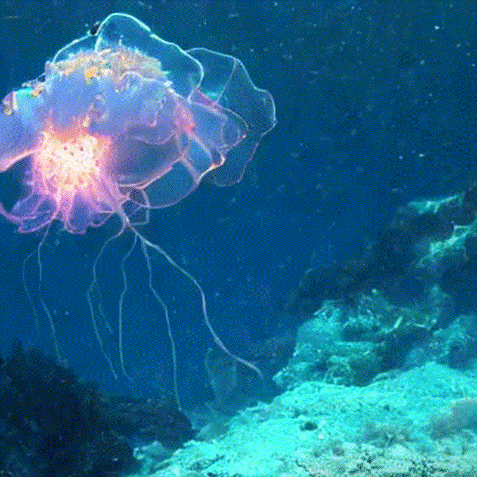

# Modelscope-Sora挑战赛第五名参赛方案

本项目是由`ame_code`队伍在[`Modelscope-Sora挑战赛`](https://tianchi.aliyun.com/competition/entrance/532219)复赛中的方案。以下详细描述了数据筛选过程、模型训练与推理步骤，以及最终的评测方法。基于本仓库,可在最低`24GB GPU`上实现对文生视频任务的学习及实验。本仓库首先给出比赛数据筛选方案，接下来给出数据筛选方案复现及模型训练、推理及评测代码。


### 数据生成筛选方案

#### 1.视频场景切分

利用 `scenedetect` 库中的内容检测器来识别原始数据集中视频场景切换。对于每个检测到的场景，如果其持续时间大于2秒，会将其保存为一个独立的视频文件；否则，将原始视频保存为一个场景。通过遍历所有视频文件并调用处理函数，将视频数据进行场景切分并保存为多个独立的视频文件。经过视频场景切分,共得到**92687**个视频片段。

#### 2.视频片段筛选

在场景切分得到的视频数据基础上，分别经过 `video_motion_score_filter`、`video_ocr_area_ratio_filter`、`video_aesthetics_filter`、`video_nsfw_filter` 以及 `video_watermark_filter` 算子的筛选。筛选的阈值见 `demo_config.yaml` 文件。以下是各算子的含义、运算过程中的线程数，以及经过筛选算子后剩余的视频数量：

| 算子名称                      | 算子含义                                                     | 线程数量 | 经过算子前片段数量 | 经过算子后片段数量 | 备注                             |
| ----------------------------- | ------------------------------------------------------------ | -------- | ------------------ | ------------------ | -------------------------------- |
| `video_motion_score_filter`   | 保留包含视频的运动分数（基于稠密光流）在指定范围内的样本     | 1        | 92687              | 92547              | 该算子处理时间较长，首先进行处理 |
| `video_ocr_area_ratio_filter` | 保留包含视频的特定帧中检测出的文本的面积占比在指定范围内的样本 | 4        | 92547              | 89275              |                                  |
| `video_aesthetics_filter`     | 保留指定帧的美学分数在指定范围内的样本                       | 4        | 89275              | 69786              |                                  |
| `video_nsfw_filter`           | 保留包含视频的NSFW分数在指定阈值之下的样本                   | 4        | 69786              | 69071              |                                  |
| `video_watermark_filter`      | 保留包含视频有水印的概率在指定阈值之下的样本                 | 4        | 69071              | 62360              |                                  |

#### 3.视频caption生成

对于完成视频质量筛选的视频片段，接下来采用 `video_captioning_from_video_mapper` 算子为每个视频生成描述（caption）。以下是拥有描述的视频样本示例：

```json
{"videos":["./dj_video_47742_0.mp4"],"text":"<__dj__video> Two palm trees standing in front of a building. \n <|__dj__eoc|>"}
{"videos":["./dj_video_47743_0.mp4"],"text":"<__dj__video> An aerial view of a field with a river flowing through it. \n <|__dj__eoc|>"}
```

#### 4.带caption的样本筛选

对于带有描述（caption）的样本，进一步采用 `video_frames_text_similarity_filter` 和 `perplexity_filter` 算子进行筛选。筛选的阈值见 `demo_config.yaml` 文件.以下是各算子的含义、运算过程中的线程数，以及经过筛选算子后剩余的视频数量：

| 算子名称                            | 算子含义                                                     | 线程数量 | 经过算子前片段数量 | 经过算子后片段数量 | 备注                                             |
| ----------------------------------- | ------------------------------------------------------------ | -------- | ------------------ | ------------------ | ------------------------------------------------ |
| video_frames_text_similarity_filter | 保留视频中指定帧的图像-文本的特征余弦相似度(基于CLIP模型)在指定范围内的样本 | 2        | 62360              | 62360              |                                                  |
| perplexity_filter                   | 保留困惑度低于指定阈值的样本                                 | 2        | 62360              | 62045              |                                                  |
| video_motion_score_filter           | 保留包含视频的运动分数（基于稠密光流）在指定范围内的样本     | 1        | 62045              | 41549              | 在初赛的基础上设置阈值为2.599,对数据集进一步筛选 |

> 比赛期间由于算力和时间限制,没有对92687个视频完整打分和筛选,此外,对于caption为乱码的视频进行了剔除。

#### 5. 使用CogVLM2-Video模型重新生成部分数据caption

由于时间和算力限制,随机挑选数据集中`17,529`个视频样本数据,使用`CogVLM2-Video`模型生成更详细的`caption`。


### 项目目录结构

```bash
├── data_juicer # data_juicer库文件,可重新下载安装替换编译
├── dataset_processed.py # 数据生成筛选
├── dataset_processed.yaml # 数据生成筛选配置文件
├── dataset_weights_download.py # 模型权重下载脚本
├── install.sh # 环境安装脚本
├── output # 存放权重及数据集文件
│   ├── lora_model
│   │   └── checkpoint-31164.safetensors # 微调得到的模型权重,本参赛方案的模型权重可前往huggingface下载
│   ├── processed_data
│   │   ├── log # 数据处理日志文件存放
│   │   ├── recaption_second_round_motion_sort_41k.jsonl # 本参赛方案最终微调文本-视频对文件目录
│   │   └── scene_detect.jsonl # 本参赛方案视频切分完成的视频文件目录
│   └── train.log # 训练日志
├── readme.md
├── solution
│   ├── multi_video_scene_detect.py # 视频切分脚本
│   └── requiements.txt # 视频切分安装依赖
├── src # 视频图像资源文件
└── train_infer_evaluate # 模型微调推理评测文件夹
    ├── config
    │   └── easyanimate_video_motion_module_v1.yaml # 训练配置文件
    ├── easyanimate # easyanimate项目文件夹
    ├── evaluation # 视频评测项目文件夹
    │   ├── evaluate.py # 视频评测python脚本
    │   ├── evaluate.sh # 视频评测bash脚本
    │   ├── requirements.txt # 视频评测安装依赖
    │   ├── vbench # 视频评测框架Vbench项目文件夹
    │   ├── vbench_models # 视频评测模型存放目录(需要自行下载)
    │   └── VBench_sub_info.json # 视频评测prompt与评测指标
    ├── infer_lora_512.sh # 模型推理(视频生成)脚本
    ├── pretrained_models # 模型微调基础权重文件夹，需要使用dataset_weights_download.py脚本下载
    │   ├── Diffusion_Transformer # 需要自行下载
    │   └── Motion_Module # 需要自行下载
    ├── requirements.txt # 模型微调推理安装依赖
    ├── scripts # 模型微调推理脚本文件夹
    │   ├── infer_lora.py
    │   └── train_lora.py
    └── train_lora_512.sh # 模型微调脚本

```

### 环境准备与模型权重下载

#### 1.运行环境配置

本项目在`Ubuntu 20.04`环境下测试运行，`GPU`环境为`RTX 3090 * 2`，理论上最低`GPU`配置为`RTX3090 * 1`。

```bash
sudo apt update
sudo apt install aria2
conda create -n sora python=3.10
conda activate sora
bash install.sh
```

> 环境准备若出现问题,可参考官方提供的[竞赛组件](https://dail-wlcb.oss-cn-wulanchabu.aliyuncs.com/dj-competition/modelscope_sora/dj_sora_challenge.zip?spm=a2c22.12281978.0.0.49c434f97rfgMs&file=dj_sora_challenge.zip)配置运行环境。

#### 2.模型权重下载

```python
python dataset_weights_download.py
```

> 保证硬盘有500G以上，推荐1T空间，需要确保网络畅通，若数据下载失败，可参考官方提供的[竞赛组件](https://dail-wlcb.oss-cn-wulanchabu.aliyuncs.com/dj-competition/modelscope_sora/dj_sora_challenge.zip?spm=a2c22.12281978.0.0.49c434f97rfgMs&file=dj_sora_challenge.zip)下载数据集和权重。

需要在此设置输出视频的路径

### 数据生成筛选方案代码复现

首先对下载得到的`50,000`视频数据进行场景切分：

```bash
cd ./solution
python multi_video_scene_detect.py
```

> 需要进入`multi_video_scene_detect.py`脚本配置目录参数。

获得切分完成的视频数据后,对视频数据进行筛选以及使用`dj-juicer`的`caption`生成算子生成`caption`：

```bash
cd .. #回到项目根目录下
python dataset_processed.py
```

> 运行`dataset_processed.py`脚本前应该首先进入`dataset_processed.yaml`文件，按照注释提示修改参数配置，注意要替换**绝对路径**。


### 模型训练

```bash
cd ./train_infer_evaluate
bash train_lora_512.sh
```

本项目方案采用 `16x512x512` 分辨率的视频进行训练时，[比赛训练规模限制为](https://tianchi.aliyun.com/competition/entrance/532219/information)：

$$
3 \times 41549 < 125k
$$


### 模型推理(生成视频)

采用模型推理脚本可生成测试集视频：

```bash
cd ./train_infer_evaluate
bash infer_lora_512.sh
```

> 本实验方案最终模型[下载链接](https://huggingface.co/tangyipeng100/EasyAnimate_512_rank5_lora/tree/main)。


### 生成视频评测

采用生成视频评测脚本可在[VBench](https://github.com/Vchitect/VBench)上评测生存视频质量：

```bash
cd ./train_infer_evaluate/evaluation
bash evaluate.sh
```


### 生成视频展示

根据初赛提示词生成视频：

<div style="display: flex; justify-content: space-between; align-items: center;">
    <div style="text-align: center;">
        
        <p>Prompt：A beautiful coastal beach in spring, waves lapping on sand by Hokusai, in the style of Ukiyo</p>
    </div>
    <div style="text-align: center;">
        
        <p>Prompt: A bigfoot walking in the snowstorm</p>
    </div>
    <div style="text-align: center;">
        
        <p>Prompt: A jellyfish floating through the ocean, with bioluminescent tentacles</p>
    </div>
</div>


### TODO LIST

- [ ] 比赛原始视频数据集
- [ ] 切分后视频数据集
- [ ] 使用data_juicer算子完成视频caption推理和视频切分


### 致谢

1.[`Modelscope-Sora挑战赛`](https://tianchi.aliyun.com/competition/entrance/532219)

2.[`VBench`](https://github.com/Vchitect/VBench)

3.[`CogVLM2-Video`](https://cogvlm2-video.github.io/)

4.[`ModelScope魔搭社区`](https://community.modelscope.cn/)


